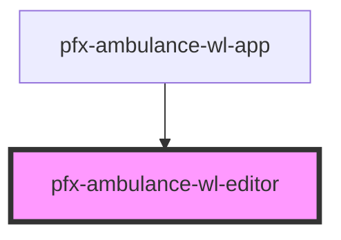

# pfx-ambulance-wl-editor

<!-- Auto Generated Below -->

## Properties

| Property      | Attribute      | Description | Type     | Default     |
| ------------- | -------------- | ----------- | -------- | ----------- |
| `ambulanceId` | `ambulance-id` |             | `string` | `undefined` |
| `apiBase`     | `api-base`     |             | `string` | `undefined` |
| `entryId`     | `entry-id`     |             | `string` | `undefined` |

## Events

| Event           | Description | Type                  |
| --------------- | ----------- | --------------------- |
| `editor-closed` |             | `CustomEvent<string>` |

## Dependencies

### Used by

 - [pfx-ambulance-wl-app](../pfx-ambulance-wl-app)

### Graph

----------------------------------------------

*Built with [StencilJS](https://stenciljs.com/)*
